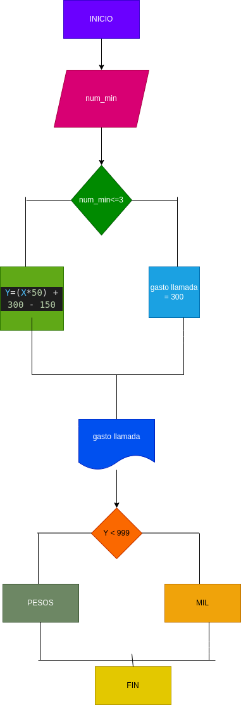

# llamada_telefonica

# programa para calcular el costo de una llamada telefónica

# ingresar el tiempo de duracion de una llamada telefonica y determinar la cantidad a pagar, deacuerdo con lo siguiente:
- toda llamada que dure 3 minutos o menos tiene un costo de 300 pesos
- cada minuto adicional cuesta 50 pesos

